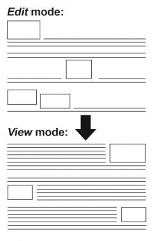

## AutoFloat

A text format filter that adds an odd/even class to images or spans
(image + caption) to make them float alternately left and right with CSS.

Helps to put an end to inline styling.

Configurable:
*   the starting side
*   to exclude the module's CSS to use your custom.css
*   to add classes to target a 'span', e.g. in case a caption is displayed
*   to add classes to exclude a 'div', e.g. a set of thumbnails.

### Example

The filter turns:

    ‹img src="/path/photo.jpg"›

into:

    ‹img src="/path/photo.jpg" class="autofloat-odd"›

### Features

*   Generates an organized layout automatically 
    (see image above).
*   For non-technical editors or simply as a time-saver.
*   Compatible with all WYSIWYG editors and the [Insert](https://github.com/backdrop-contrib/insert "GitHub project page") module.
*   Avoids inline styling. When creating a float manually with the Rich Text (WYSIWYG) editor, undesired inline code is added that cannot be overridden with CSS ([see video](http://www.youtube.com/watch?v=7taQjWHRlc4 "Avoid in-line styling in your Rich Text (WYSIWYG) Editor- YouTube.com")).
*   Insert images later without messing up the alternating left/right floating pattern, as would happen with manually added floats.
*   Classes are configurable to: 
    - auto float images added by other modules.
    - ignore sets of thumbnails or single images.
*   Configure the starting side to be left or right.
*   Flips images to the opposite sides in right-to-left themes for multi-language sites.
*   Pre-configured to work out-of-the-box with the [Flickr](https://github.com/backdrop-contrib/flickr "GitHub project page") module.

### Installation 

Install this module using the official Backdrop CMS instructions at
https://backdropcms.org/guide/modules

### Configuration

*   Add the autofloat filter to one of your text formats at: 
    - */admin/config/content/formats*
       Put it below other image related filters in the:
    - *filter processing order*   
*   Settings at:
    - */admin/config/content/autofloat*
    - */admin/settings/autofloat*
    Options :
    - Starting side, left or right.
    - If desired, exclude the *autofloat.css* file to use your theme's *style.css* instead.
    - Add classes to:
    &nbsp;&nbsp;- target a *'span'* if a caption is displayed under the image
    &nbsp;&nbsp;- exclude a *'div'* for a set of thumbnails.
*   Re-save existing nodes you want to apply AutoFloat to.

### Usage

*   All images will float unless they have the class *'nofloat'*.
*   A *'span'* with the class *'float'* will float all containing content, e.g. to use for images with a caption under it.
*   Images in a div with the class *'nofloat'* do NOT float, to use for a set of thumbnails.
*   Optionally define a custom class used for thumbnail sets (inside a _'div'_) or images with a caption (inside a *'span'*). [Use your browser's inspector](http://trac.webkit.org/wiki/WebInspector "Web Inspector - WebKit.org") to find them.
*   The class *'nofloat'* of a nested image has priority over classes set in the parent element, therefore the whole parent will not float.

### What popular 'caption' modules are tested to work with AutoFloat?

*   The [Flickr](https://github.com/backdrop-contrib/flickr "GitHub project page") module adds a caption taken from the info available on Flickr. Apart from the title this can also include the date taken, location and photographer. One of the easiest ways to add a caption to embedded images.
*   [jCaption](https://github.com/backdrop-contrib/jcaption "GitHub project page").  This captioning works without the need of additional user action per image. In the jCaption settings '_Copy class_' has to be selected (is the default).
*   [Image Caption](https://github.com/backdrop-contrib/image_caption "GitHub project page").
*   [Caption Filter](https://github.com/backdrop-contrib/caption_filter "GitHub project page") uses its own system for floating that must be used for those images.

### Troubleshooting

**Images don't float in *Edit* mode. Text filters are applied in *View* mode only.**
This is normal behavior.

**Images don't float after installing the module or changing the configuration options.**
Re-save existing nodes you want to apply AutoFloat to.  If you still can't see any changes, **try clearing both your [site](https://drupal.org/node/42055 "Clearing Drupal's cache | Drupal.org") and [browser cache](http://www.wikihow.com/Clear-Your-Browser's-Cache "13 Ways to Clear Your Browser's Cache - wikiHow")**.

**_They still don't float or other unexpected display problems occur._**
It should be noted that the cascading stylesheets defined by modules are by default loaded before theme CSS ([see Backdrop API](https://api.backdropcms.org/api/backdrop/core%21includes%21common.inc/function/backdrop_add_css/1 "backdrop_add_css | common.inc | Backdrop 1 | Backdrop API")). AutoFloat's style might be overwritten by the theme stylesheets. In that case copy and paste the code from the *autofloat.css* file to the bottom of your theme's *style.css* file or use [this solution](http://k-it.ca/comment/14#comment-14 "K-IT.ca Inc. - Including Site-Specific Files and Code in a Drupal Site").
 **OR**
Your theme might not use the class *'content'* to target the node body, if it does not follow [standard core classes](http://drupal.org/node/388372). Use your [browser inspector](https://developers.google.com/chrome-developer-tools/docs/overview) to find the ones used by your theme and adjust the class used in the module's CSS files accordingly.

Remember an element floats within the block-element containing it. If that doesn't cover the full width, the image might not float as expected. AutoFloat is intended for a relative 'flat' node body structure (not deeply nested).

**The images in the blocks also Auto Float.**
Use another text format that doesn't include AutoFloat for your blocks.
 **OR**
change the class/id to target in the module's CSS files. Try to use 'content-content' instead of 'content' (depending on your theme). Leave the leading dots and hashes.

**Override AutoFloat behaviour using [Flickr Filter](https://drupal.org/node/2171503 "Flickr Filter documentation") tags.**
If you enable the [AutoFloat module](https://drupal.org/project/autofloat "Project page") using [Flickr Filter](https://drupal.org/node/2171503 "Flickr Filter documentation") tags, it precedes over the existing 'floatleft' and 'floatright' classes found, but not over the inline styles. Thus inline styling is a way to override AutoFloat behaviour, for example:
`[flickr-photo:id=9247388074, size=m, style=float:right;]`
The margins on the 'text side' of the image from autofloat.css get applied anyway, so the text doesn't lean against the image.

### License

This project is GPL v2 software. See the LICENSE.txt file in this directory for
complete text.

### Author & Maintainer

- Martin Postma ([lolandese](https://www.drupal.org/u/lolandese))
